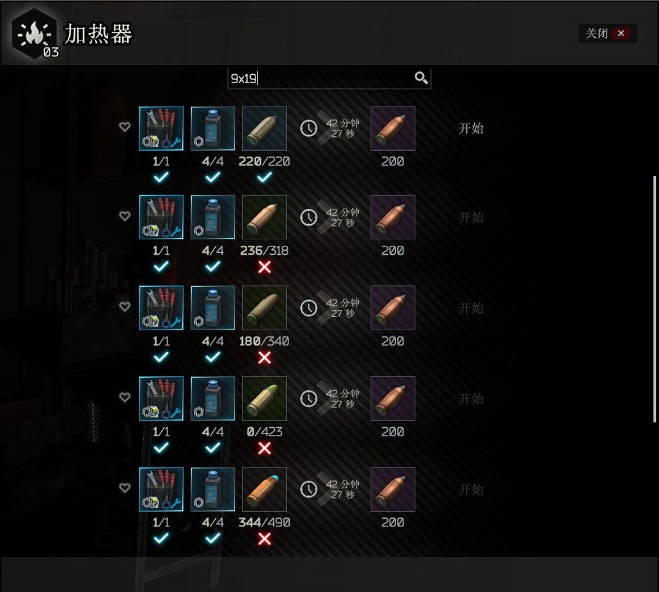
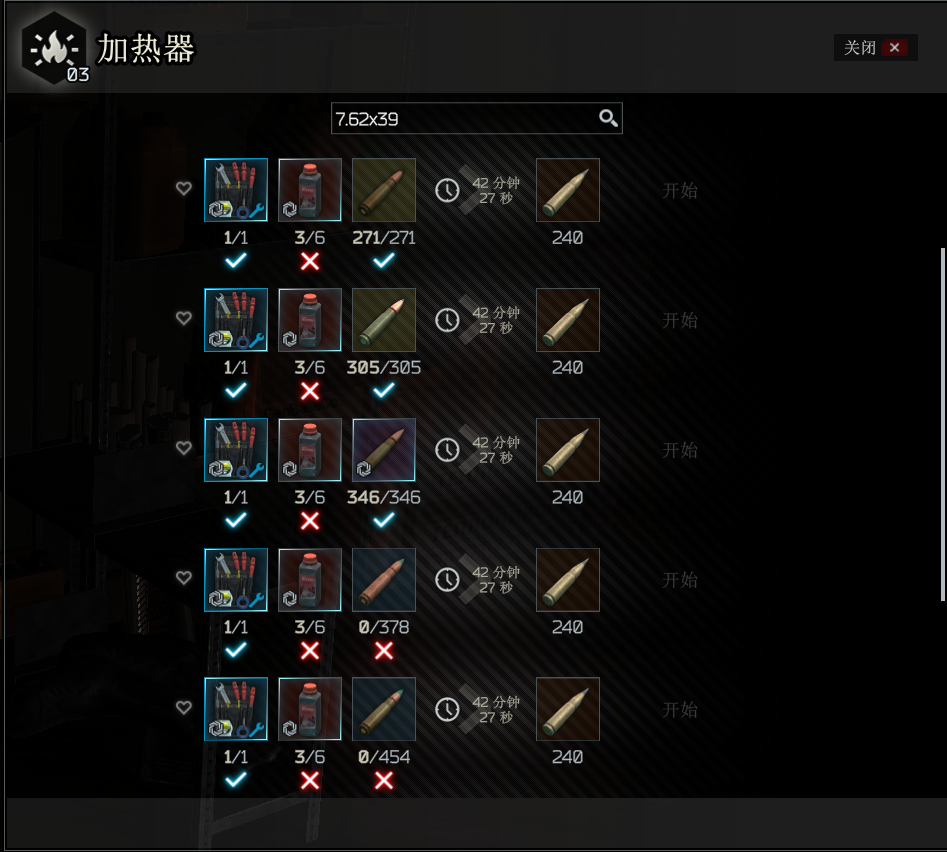

# description
extend ammunition craft for SPTarkov

low penetration ammos can be craft to high penetration ammos.

they are a lot of recipes, so i decide to put them in **heating** area, and you may want filter them by name like `9x19` or `7.62x39`.

### requirements
- area **heating** level 1
- area **workbench** level 1

# install
unarchive released zip file and put them in your SPTarkov game folder like `C:\EscapeFromTarkov`, it is should be have the file `SPT.Server.exe` there.

# preview

